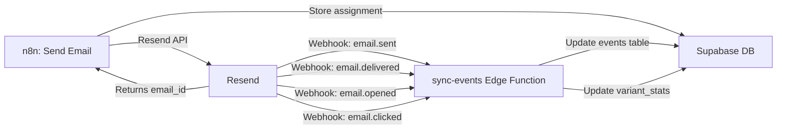

# Resend Integration Guide

**Email Provider:** Resend (resend.com)  
**Why Resend:** Simpler API, built-in webhooks, better developer experience than Brevo

---

## 🚀 Setup Resend (15 minutes)

### Step 1: Create Account
1. Go to https://resend.com/
2. Sign up with GitHub or email
3. Verify your email address

### Step 2: Get API Key
1. Go to https://resend.com/api-keys
2. Click "Create API Key"
3. Name: `PreventIQ Production`
4. Permission: `Sending access`  
5. Copy the API key (starts with `re_`)

### Step 3: Add to Supabase Secrets
```bash
npx supabase secrets set RESEND_API_KEY=re_... --linked
```

### Step 4: Verify Domain (Optional - for production)
**For Testing:** Use `onboarding@resend.dev` as the `from` address (no domain needed)

**For Production:**
1. Go to https://resend.com/domains
2. Click "Add Domain"
3. Enter your domain (e.g., `preventiq.com`)
4. Add DNS records:
   - SPF: `v=spf1 include:amazonses.com ~all`
   - DKIM: (provided by Resend)
   - Custom Return-Path: (provided by Resend)
5. Wait for verification (usually 5-10 minutes)

---

## 📧 Email Template

Resend uses **React Email** or **HTML templates**. For the MVP, we'll use simple HTML.

### Test Email (from n8n):
```typescript
// n8n HTTP Request Node - Send Email via Resend
{
  method: 'POST',
  url: 'https://api.resend.com/emails',
  headers: {
    'Authorization': 'Bearer {{$credentials.resendApiKey}}',
    'Content-Type': 'application/json'
  },
  body: {
    from: 'PreventIQ <onboarding@resend.dev>', // Testing
    // from: 'PreventIQ <noreply@preventiq.com>', // Production
    to: '{{$json.lead_email}}',
    subject: '{{$json.subject}}',
    html: `
      <!DOCTYPE html>
      <html>
      <head>
        <meta charset="utf-8">
        <style>
          body { font-family: Arial, sans-serif; line-height: 1.6; color: #333; }
          .container { max-width: 600px; margin: 0 auto; padding: 20px; }
          .header { background: #0066cc; color: white; padding: 20px; text-align: center; }
          .content { padding: 20px; background: #f9f9f9; }
          .cta { display: inline-block; background: #0066cc; color: white; padding: 12px 24px; text-decoration: none; border-radius: 5px; margin: 20px 0; }
        </style>
      </head>
      <body>
        <div class="container">
          <div class="header">
            <h1>PreventIQ Health Insights</h1>
          </div>
          <div class="content">
            <h2>Hi {{$json.lead_name}},</h2>
            <p>Your personalized health assessment is ready.</p>
            <p>Take the first step towards better health today.</p>
            <a href="https://zdgvndxdhucbakguvkgw.supabase.co/functions/v1/track-click/{{$json.assignment_id}}" class="cta">
              Get Your Free Assessment
            </a>
            <p style="color: #666; font-size: 12px;">
              This email was sent because you signed up for PreventIQ health insights.
            </p>
          </div>
        </div>
      </body>
      </html>
    `,
    tags: [
      { name: 'campaign', value: 'preventiq_daily' },
      { name: 'persona', value: '{{$json.persona_id}}' }
    ]
  }
}
```

---

## 🔔 Webhook Setup

Resend automatically sends events to your webhook - **no polling needed!**

### Step 1: Get Webhook URL
After creating the n8n webhook workflow (Flow D), you'll get a URL like:
```
https://your-n8n-instance.app.n8n.cloud/webhook/resend-events
```

### Step 2: Add Webhook in Resend
1. Go to https://resend.com/webhooks
2. Click "Add Webhook"
3. **Endpoint URL:** `https://zdgvndxdhucbakguvkgw.supabase.co/functions/v1/sync-events`
4. **Events to track:**
   - ✅ `email.sent`
   - ✅ `email.delivered`
   - ✅ `email.opened` (requires HTML emails)
   - ✅ `email.clicked` (requires tracked links)
   - ✅ `email.bounced`
   - ✅ `email.complained`
5. Click "Add Webhook"
6. Copy the **Signing Secret** (starts with `whsec_`)

### Step 3: Verify Webhook Signature (Recommended for production)
```typescript
// In sync-events Edge Function (optional security enhancement)
const signature = req.headers.get('svix-signature');
const webhookSecret = Deno.env.get('RESEND_WEBHOOK_SECRET');

// Verify using Svix library
// import { Webhook } from 'https://esm.sh/@svix/svix';
// const wh = new Webhook(webhookSecret);
// wh.verify(payload, signature);
```

---

## 📊 Resend Event Flow



---

## 🎯 Resend vs Brevo Comparison

| Feature | Resend | Brevo |
|---------|--------|-------|
| **API Simplicity** | ⭐⭐⭐⭐⭐ Clean, modern | ⭐⭐⭐ Complex |
| **Webhooks** | ✅ Built-in, real-time | ❌ Need polling |
| **Free Tier** | 3,000 emails/month | 300 emails/day |
| **Developer Experience** | ⭐⭐⭐⭐⭐ Excellent docs | ⭐⭐⭐ Good |
| **React Email Support** | ✅ Yes | ❌ No |
| **Setup Time** | 10 minutes | 30 minutes |
| **n8n Integration** | Simple HTTP request | Complex polling |

**Winner:** Resend ✅

---

## ✅ Testing Resend Integration

### Test 1: Send Email via API
```bash
curl -X POST https://api.resend.com/emails \
  -H "Authorization: Bearer re_..." \
  -H "Content-Type: application/json" \
  -d '{
    "from": "onboarding@resend.dev",
    "to": "your-email@example.com",
    "subject": "Test from PreventIQ",
    "html": "<h1>Hello from PreventIQ!</h1>"
  }'
```

**Expected Response:**
```json
{
  "id": "d91bca48-c392-4a33-9c30-7c2e3f336f7f"
}
```

### Test 2: Verify Webhook Delivery
1. Send a test email via Resend API
2. Check Resend Dashboard → Webhooks → Recent Deliveries
3. Verify sync-events function received the webhook
4. Check `events` table in Supabase for the new event

### Test 3: Test Click Tracking
1. Send email with tracked link
2. Click the link in the email
3. Verify `email.clicked` webhook received
4. Check `variant_stats` table - alpha should increment

---

## 🔧 Environment Variables

### Supabase Secrets
```bash
# Required
npx supabase secrets set RESEND_API_KEY=re_... --linked

# Optional (for webhook signature verification)
npx supabase secrets set RESEND_WEBHOOK_SECRET=whsec_... --linked
```

### n8n Credentials
1. Go to n8n → Credentials → Add Credential
2. Select "HTTP Header Auth"
3. Name: `Resend API`
4. Header Name: `Authorization`
5. Header Value: `Bearer re_...`

---

## 📝 Migration from send-welcome-email

The `send-welcome-email` function already uses Resend! We can reuse the same pattern:

```typescript
// Existing code in send-welcome-email/index.ts
const resendApiKey = Deno.env.get('RESEND_API_KEY');

const response = await fetch('https://api.resend.com/emails', {
  method: 'POST',
  headers: {
    'Authorization': `Bearer ${resendApiKey}`,
    'Content-Type': 'application/json',
  },
  body: JSON.stringify({
    from: 'PreventIQ <onboarding@resend.dev>',
    to: lead.email,
    subject: 'Welcome to PreventIQ',
    html: emailHtml,
  }),
});

const { id: emailId } = await response.json();
```

**This is exactly what n8n will do in Flow C!**

---

## 🎉 Benefits of Resend

1. **Real-time webhooks** - No polling, instant event processing
2. **Simple n8n integration** - Just HTTP requests, no special nodes needed
3. **Better deliverability** - Built on AWS SES with optimized infrastructure
4. **React Email support** - Can use JSX for templates (future enhancement)
5. **Free tier is generous** - 3,000 emails/month for testing
6. **Excellent documentation** - https://resend.com/docs

---

## 🚀 Next Steps

1. **Sign up for Resend** → https://resend.com/
2. **Get API key** → https://resend.com/api-keys
3. **Set Supabase secret:**
   ```bash
   npx supabase secrets set RESEND_API_KEY=re_... --linked
   ```
4. **Test send-welcome-email function** (already uses Resend)
5. **Deploy sync-events function** (updated for Resend webhooks)
6. **Configure Resend webhook** → Point to sync-events function
7. **Build n8n Flow C** → Use simple HTTP request to Resend API

---

## 📚 Resources

- Resend Docs: https://resend.com/docs
- API Reference: https://resend.com/docs/api-reference/emails/send-email
- Webhooks: https://resend.com/docs/api-reference/webhooks/webhook-events
- React Email: https://react.email/
- n8n HTTP Request: https://docs.n8n.io/integrations/builtin/core-nodes/n8n-nodes-base.httprequest/

---

**Ready to use Resend!** 🎯
